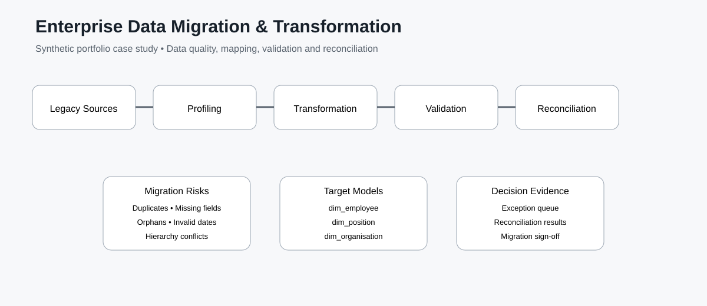

# 🔄 Enterprise Data Migration & Transformation

## About the Project

A synthetic enterprise data-migration case study built around a practical question:

> **Can legacy data be trusted before it is loaded into a new target system?**

The project simulates a legacy HR-style environment containing employee, position, organisation and location data. It deliberately includes realistic migration risks—duplicates, missing mandatory attributes, orphan references, invalid effective dates and reconciliation differences—then demonstrates how an analyst can identify, transform, validate and sign off the data.

## Business Problems

- Duplicate employee records
- Missing mandatory employee attributes
- Invalid start/end dates
- Unknown organisation and location references
- Invalid manager relationships
- Source-to-source differences
- Exception prioritisation before migration
- Evidence required for migration sign-off

## Migration Workflow

**Legacy Sources → Profiling → Source-to-Target Mapping → Transformation → Validation → Reconciliation → Target Model → Sign-off**

## Source Data

| Source | Purpose |
|---|---|
| Employees | Employee master and employment dates |
| Positions | Position, manager and organisation relationships |
| Organisations | Hierarchy and department structure |
| Locations | Location reference data |
| Alternate employee source | Independent source for reconciliation |

All records are synthetic portfolio data.

## Target Models

- `dim_employee`
- `dim_position`
- `dim_organisation`
- `migration_exception`

The target layer is designed around clean, governed entities rather than simply copying the legacy structure.

## Tooling

- **SQL** — profiling, integrity checks, effective-date validation, reconciliation and exception logic
- **Python / pandas** — profiling, transformation and repeatable migration checks
- **DuckDB** — local analytical execution against CSV extracts
- **dbt concepts** — staging, intermediate and mart layers, source definitions and tests
- **GitHub Actions** — automated test execution

## Business Investigation Tickets

1. Duplicate employee investigation
2. Organisation hierarchy mismatch
3. Position / manager integrity
4. Source-to-target reconciliation
5. Effective-date conflict
6. Migration sign-off

Each ticket is written as a business investigation rather than as a purely technical query.

## What This Demonstrates

This project demonstrates the ability to:

- Translate migration risk into analytical checks
- Profile legacy data before transformation
- Define source-to-target mappings
- Detect referential-integrity failures
- Validate effective-dated records
- Reconcile independent sources
- Create prioritised migration exceptions
- Produce evidence suitable for a migration decision
- Structure transformations into reusable staging/intermediate/mart layers

## Project Preview



## Quick Start

```bash
python -m pip install -r requirements.txt
python python/profile_migration.py
python python/transform_migration.py
pytest -q
```

To load the sample data into DuckDB:

```bash
python dbt/load_sample_data.py
```

The loader creates `dbt/target/migration.duckdb` and registers the CSV extracts as tables. The database is ignored by Git.

## Repository Structure

```text
Enterprise-Data-Migration-Transformation/
├── business-tickets/
├── data/sample/
├── dbt/
│   ├── models/staging/
│   ├── models/intermediate/
│   ├── models/marts/
│   └── load_sample_data.py
├── docs/
├── python/
├── sql/
├── tests/
├── .github/workflows/ci.yml
├── README.md
└── requirements.txt
```

## Data Integrity Statement

This is a **synthetic portfolio project**. It does not contain employer data, customer data or production migration results. The intentionally introduced defects are there to demonstrate how migration controls can identify and prioritise risk.
